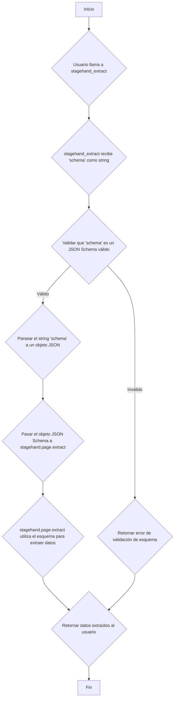

# Plan para la Mejora de Seguridad en `stagehand_extract`

El objetivo es eliminar el uso de `eval` para procesar el parámetro `schema` en la herramienta `stagehand_extract`, reemplazándolo por un mecanismo seguro que permita definir la estructura de los datos a extraer.

## 1. Alternativas Seguras Consideradas

Hemos considerado las siguientes alternativas para definir y procesar los esquemas de extracción de forma segura:

*   **A. Formato de Esquema Basado en JSON (JSON Schema):** Utilizar un estándar bien establecido como JSON Schema para describir la estructura de los datos esperados. Existen librerías seguras para validar datos contra un JSON Schema.
*   **B. Lenguaje de Descripción de Esquemas Simple (DSL):** Diseñar un lenguaje de dominio específico simple y limitado para definir estructuras de datos. Este DSL sería parseado y procesado de forma segura por el servidor.
*   **C. Definición de Esquemas Basada en Objetos JavaScript (Serializado):** Permitir que el usuario defina el esquema como un objeto JavaScript (posiblemente utilizando Zod, dado el contexto actual), pero requerir que este objeto sea serializado a un formato seguro (como JSON) antes de ser enviado a la herramienta. El servidor deserializaría y validaría la estructura.
*   **D. Uso de una Librería de Parsing Seguro (como `json5` o similar para un formato extendido de JSON):** Si se necesita algo más flexible que JSON pero sin la inseguridad de `eval`, se podría usar una librería que parsee un formato de datos más permisivo de forma segura. Sin embargo, esto aún podría introducir complejidad y posibles vectores de ataque si la librería no es robusta.

## 2. Alternativa Recomendada y Justificación

La alternativa recomendada es la **A. Formato de Esquema Basado en JSON (JSON Schema)**.

*   **Justificación:**
    *   **Seguridad:** JSON Schema es un estándar de la industria con implementaciones de parsing y validación seguras y bien probadas. Elimina completamente la necesidad de ejecutar código arbitrario (`eval`).
    *   **Flexibilidad:** Permite definir estructuras de datos complejas, tipos de datos, validaciones básicas (como rangos numéricos, longitudes de cadena, patrones regex), y relaciones entre propiedades.
    *   **Interoperabilidad:** Es un formato ampliamente conocido y utilizado, lo que facilitaría a los usuarios la definición de esquemas.
    *   **Ecosistema:** Existen numerosas librerías en varios lenguajes para trabajar con JSON Schema, lo que simplificaría la implementación en el servidor Stagehand-MCP.
    *   **Claridad:** La definición del esquema sería declarativa y fácil de entender.

Aunque Zod (aparentemente usado actualmente) es una excelente librería para definición de esquemas en TypeScript/JavaScript, enviar código Zod como una cadena para ser evaluada es inherentemente inseguro. Adoptar JSON Schema permite mantener la capacidad de definir estructuras de datos complejas de forma segura.

## 3. Plan de Alto Nivel para la Implementación

Aquí se presenta un plan de alto nivel para implementar la alternativa de JSON Schema en `stagehand-mcp/src/tools.ts`:

Pasos detallados:

1.  **Modificar la definición de la herramienta `stagehand_extract`:** Actualizar el esquema de entrada de la herramienta para que el parámetro `schema` espere una cadena que represente un JSON Schema válido, en lugar de una cadena de código JavaScript/Zod.
2.  **Añadir una librería de validación de JSON Schema:** Instalar una librería segura en el proyecto `stagehand-mcp` que pueda validar y parsear cadenas de JSON Schema (por ejemplo, `ajv` en Node.js).
3.  **Implementar la lógica de parsing y validación:** Dentro de la función que maneja la herramienta `stagehand_extract` en `stagehand-mcp/src/tools.ts`:
    *   Recibir la cadena del JSON Schema.
    *   Utilizar la librería de validación para verificar si la cadena es un JSON Schema sintácticamente correcto y válido.
    *   Si es válido, parsear la cadena a un objeto JavaScript.
    *   Si no es válido, lanzar un error descriptivo indicando que el esquema proporcionado no es un JSON Schema válido.
4.  **Adaptar la llamada a `stagehand.page.extract`:** Asegurarse de que la función `stagehand.page.extract` pueda aceptar un objeto que represente un JSON Schema como su parámetro `schema`. Esto podría requerir cambios en la librería subyacente de Stagehand si actualmente solo acepta esquemas Zod o similares. Si Stagehand subyacente no soporta JSON Schema directamente, se necesitaría una capa de traducción o adaptar Stagehand. (Este es un punto clave a investigar durante la implementación).
5.  **Manejo de errores:** Implementar un manejo robusto de errores para capturar problemas durante el parsing o la validación del esquema, y proporcionar retroalimentación clara al usuario.

## 4. Consideraciones sobre Documentación y Uso

*   **Documentación de la Herramienta:** La documentación de la herramienta `stagehand_extract` debe ser actualizada para reflejar que el parámetro `schema` ahora espera un JSON Schema. Se deben incluir ejemplos claros de cómo definir esquemas comunes (por ejemplo, extraer un objeto con propiedades específicas, extraer una lista de elementos).
*   **Ejemplos de Uso:** Proporcionar ejemplos de cómo usar la herramienta con JSON Schema en la documentación y posiblemente en los archivos de ejemplo del proyecto.
*   **Guía para Usuarios Existentes:** Si hay usuarios existentes que utilizan la herramienta con el formato de esquema anterior (basado en `eval`/Zod), se debe proporcionar una guía clara sobre cómo migrar sus esquemas al formato JSON Schema.
*   **Impacto en la Experiencia del Usuario:** Aunque JSON Schema es seguro, puede ser más verboso que el código Zod simple para algunos casos. Se debe evaluar si esto impacta significativamente la facilidad de uso para tareas comunes y considerar si se podrían ofrecer "atajos" o esquemas predefinidos para casos de uso frecuentes.