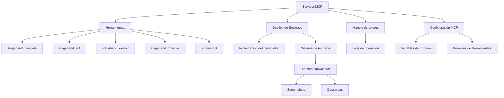

# Plan para Servidor MCP de Automatización de Navegador

## Descripción General
Este documento describe el plan para crear un servidor MCP que proporcione herramientas de automatización de navegador similares a las proporcionadas por Stagehand, basado en la implementación local de stagehand_dave.

## Diagrama de Arquitectura



## Fases de Implementación

### 1. Estructura Base del Servidor MCP
- Crear la estructura básica del servidor MCP
- Implementar el manejo de conexiones y comunicación MCP
- Configurar la gestión de sesiones del navegador local
- Crear y gestionar el directorio 'downloads'

### 2. Implementación de Herramientas
- **stagehand_navigate**: 
  - Navegación a URLs específicas
  - Manejo de errores de navegación
  - Reportes de estado de navegación

- **stagehand_act**: 
  - Realizar acciones en elementos de la página
  - Soporte para variables en acciones
  - Acciones atómicas y específicas

- **stagehand_extract**: 
  - Extracción de texto de la página
  - Filtrado de contenido CSS y JavaScript
  - Procesamiento de caracteres Unicode

- **stagehand_observe**: 
  - Observación de elementos en la página
  - Soporte para instrucciones específicas
  - Integración con el sistema de acciones

- **screenshot**: 
  - Captura de pantalla de la página
  - Guardado automático en el directorio 'downloads'
  - Generación de nombres únicos para los archivos
  - Retorno de la ruta del archivo guardado

### 3. Sistema de Archivos
- Crear y gestionar el directorio 'downloads'
- Estructura de directorios:
```
downloads/
  ├── screenshots/
  │   └── screenshot-{timestamp}.png
  └── downloads/
      └── {nombre-archivo}
```
- Implementar limpieza periódica de archivos antiguos
- Manejo de nombres de archivo únicos
- Control de permisos y acceso a directorios

### 4. Sistema de Logging y Manejo de Errores
- Implementación de logging detallado de operaciones
- Sistema de manejo de errores unificado
- Formateo de mensajes de error con contexto
- Integración con logs de operación

### 5. Configuración MCP
#### Configuración en mcp_settings.json
```json
{
  "mcpServers": {
    "stagehand-server": {
      "command": "node",
      "args": ["path/to/server/index.js"],
      "env": {
        "GOOGLE_GENERATIVE_AI_API_KEY": "your-ai-key",
        "GOOGLE_API_KEY": "your-google-key"
      },
      "disabled": false,
      "alwaysAllow": [
        "screenshot",
        "stagehand_observe",
        "stagehand_extract",
        "stagehand_act",
        "stagehand_navigate"
      ]
    }
  }
}
```

#### Variables de Entorno Requeridas
- `GOOGLE_GENERATIVE_AI_API_KEY`: Clave de API para Google AI
- `GOOGLE_API_KEY`: Clave de API de Google

### 6. Integración con Playwright (Local)
- Inicialización del navegador local
- Gestión de sesiones de navegación
- Configuración de viewport
- Opciones de lanzamiento del navegador
- Bloqueo de anuncios y otras optimizaciones
- Configuración de directorio de descargas

## Detalles de Implementación

### Herramientas MCP

Cada herramienta seguirá esta estructura básica:

```typescript
{
  name: string;
  description: string;
  inputSchema: {
    type: "object";
    properties: {
      // Propiedades específicas de cada herramienta
    };
    required: string[];
  };
}
```

### Manejo de Errores

```typescript
interface ErrorResult {
  content: [
    {
      type: "text";
      text: string;
    },
    {
      type: "text";
      text: string; // Logs de operación
    }
  ];
  isError: true;
}
```

### Gestión de Archivos

```typescript
interface FileMetadata {
  filename: string;
  path: string;
  timestamp: Date;
  type: 'screenshot' | 'download';
}
```

## Siguiente Paso

Proceder con la implementación del servidor MCP, comenzando por la estructura base, la configuración del directorio 'downloads' y la integración con Playwright para el navegador local, utilizando las claves de Google AI necesarias.